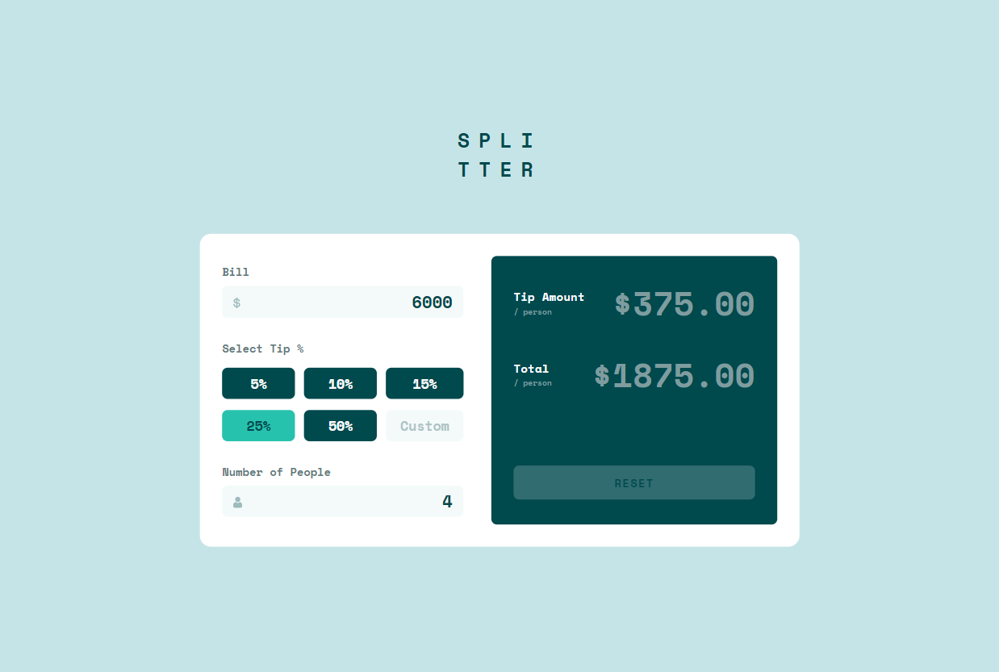
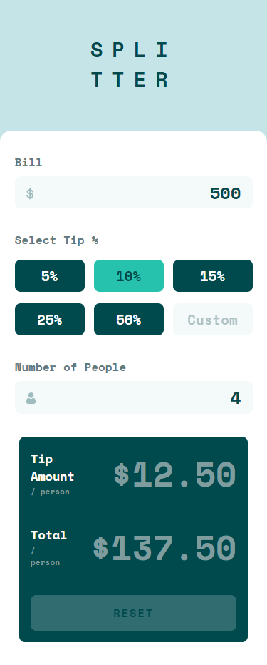
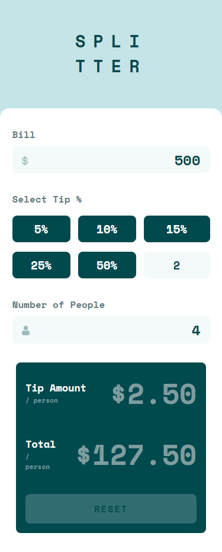

# Tip calculator app solution

## Table of contents

- [Overview](#overview)
  - [The challenge](#the-challenge)
  - [Screenshot](#screenshot)
  - [Links](#links)
- [My process](#my-process)
  - [Built with](#built-with)
  - [What I learned](#what-i-learned)
- [Acknowledgments](#acknowledgments)

## Overview

### The challenge

Users should be able to:

- View the optimal layout for the app depending on their device's screen size
- See hover states for all interactive elements on the page
- Calculate the correct tip and total cost of the bill per person
- See error message for invalid input

### Screenshot

## Desktop View

# error

## Mobile View

### Links

- Solution URL: [https://github.com/aashabul/tip-calculator-app-html-sass-js](https://github.com/aashabul/tip-calculator-app-html-sass-js)
- Live Site URL: [https://incandescent-marigold-23089e.netlify.app/](https://incandescent-marigold-23089e.netlify.app/)

## My process

### Built with

- Semantic HTML5 markup
- Sass
- Flexbox
- CSS Grid
- JavaScript

### What I learned

Dom manipulation, JavaScript core concepts and good markup practices.

## Acknowledgments

This is a solution to the [Tip calculator app challenge on Frontend Mentor](https://www.frontendmentor.io/challenges/tip-calculator-app-ugJNGbJUX). Frontend Mentor challenges help you improve your coding skills by building realistic projects.
